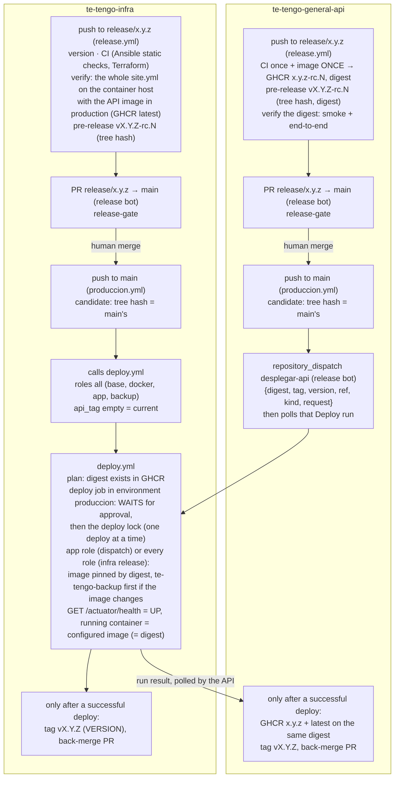

# Deploy runbook (Terraform → Ansible → Compose)

End-to-end procedure to put the Te Tengo backend in production: one **Azure VM** (`Standard_B2ats_v2`, 2 vCPU AMD, 1 GiB, Ubuntu 24.04 x64, Azure for Students subscription, region `chilecentral`) running Caddy, the API, PostgreSQL 18 and MediaMTX with Docker Compose under the `tiny` memory profile; clips and dumps in **Cloudflare R2**; DNS at **Namify**; e-mail through an **SMTP relay**; push through Firebase. **First run on 2026-10-08** (API image loaded from an archive, `te_tengo_api_source: archive`; no SMTP relay yet, so e-mails are only logged): the playbook passed its HTTPS checks, Let's Encrypt issued the certificate in seconds and the first backup reached R2. Still pending: the SMTP relay, and the first registry deploy (GHCR image) that switches production to the continuous deployment of section 4. Infrastructure details: [terraform.md](terraform.md); host and stack details: [ansible.md](ansible.md); handoff contract: [interface-terraform-ansible.md](interface-terraform-ansible.md). The inactive alternatives (`envs/oci`, plain SSH like Azure; `envs/mvp`, SSH over SSM) are noted where they differ.

## 0. Prerequisites (operator machine)
- Terraform ≥ 1.10, the Azure CLI, Ansible core ≥ 2.18 (`make galaxy` for the collections), Docker (for the local test), `jq`, `openssl`, an OpenSSH key pair.
- `az login` done with the Azure for Students account, the R2 buckets and tokens ([terraform.md](terraform.md#runbook-first-apply-on-azure-operator), steps 1–3).
- An API image in `ghcr.io/te-tengo-tech/te-tengo-general-api` built for **linux/amd64** (a release candidate of te-tengo-general-api's Release workflow, from its `release/*` branches; it publishes amd64 and arm64). Note its tag and digest (the notes of its pre-release `vX.Y.Z-rc.N`).
- Before touching the cloud, run the whole thing locally: `make test-all TT_API_SRC=../te-tengo-general-api` (same SSH path, R2-style storage, the `tiny` profile and the host capped at 1 GiB; see [ansible.md](ansible.md#local-test-without-a-cloud-account-test)).

## 1. Infrastructure (Terraform, envs/azure)
1. `az login`; fill `envs/azure/terraform.tfvars` (`subscription_id` from `az account show --query id -o tsv`, `location = "chilecentral"`, `ssh_public_key`, `app_hostname`, `object_storage_endpoint`) and `envs/azure/backend.hcl`; `make azure-init && make azure-plan`, review, `make azure-apply` ([terraform.md](terraform.md#runbook-first-apply-on-azure-operator), steps 4–6).
2. What must come out of it, checked before Ansible: an NSG with 80/tcp, 443/tcp+udp, 8322/tcp and 8189/udp+tcp (WebRTC media, live view v3) open to anyone and 22 from `admin_cidrs` (anywhere by default, key-only SSH); a `Standard_B2ats_v2` VM with a 30 GB Standard SSD; a static public IP (output `public_ip`); `memory_profile = tiny`.
3. DNS at Namify: A record `api.tetengo` in `reqsai.tech` → `public_ip` (output `dns_record`). Let's Encrypt needs the name to resolve **before** the first deploy. Check it on Namify's own name servers (`dig +short api.tetengo.reqsai.tech @tech-domains.earth.orderbox-dns.com`), not on a public resolver: the zone caches a missing name for 2 hours (SOA negative TTL 7200 s), so a lookup before the record exists keeps failing on that resolver for up to 2 hours. For the same reason, start the app role (Caddy) only once the record is there; `--tags base,docker,backup` can run before.
4. First SSH with host-key verification against the boot diagnostics serial log ([terraform.md](terraform.md#runbook-first-apply-on-azure-operator), step 8).

## 2. Inventory and vault
```bash
make inventory                                   # ansible/inventory/hosts.yml from envs/azure outputs (git-ignored)
cp ansible/group_vars/te_tengo/vault.yml.example ansible/group_vars/te_tengo/vault.yml
$EDITOR ansible/group_vars/te_tengo/vault.yml    # see "Secrets inventory"
ansible-vault encrypt ansible/group_vars/te_tengo/vault.yml
```
**Production settings that are not secret live in the committed [`ansible/prod.yml`](../ansible/prod.yml)**: image source (`registry`, public package, `te_tengo_api_tag: current`), `te_tengo_acme_email`, `te_tengo_push_provider`, the PWA's origins (`te_tengo_hls_allow_origins` and `TT_CORS_ORIGENES`, `TT_PWA_URL`, `TT_ENLACE_BASE` in `te_tengo_api_settings`) and the deploy key in `te_tengo_authorized_keys`. `make deploy` and `make redeploy` pass it (`DEPLOY_VARS`), and so does the Deploy workflow, so the operator and CI render the same configuration. It is an extra-vars file rather than `group_vars/te_tengo` because that group also holds the local test host and the inactive OCI and AWS hosts. Only operator-specific values go in an untracked `ansible/prod.local.yml` passed after it (`ANSIBLE_ARGS="-e @prod.local.yml"`): the operator's `ansible_ssh_private_key_file`, or `te_tengo_api_source: archive` with `te_tengo_api_archive`. Remove from an existing `prod.local.yml` the values now in `prod.yml` (ACME e-mail, push provider, origins, `te_tengo_api_settings`): being passed later, they would shadow future changes of `prod.yml`. Other settings, in `prod.yml` or `ansible/group_vars/te_tengo/vars.yml`: the SMTP relay (`te_tengo_smtp_host`, `te_tengo_smtp_port`, `te_tengo_smtp_security`, `te_tengo_smtp_sender`; only once the API release supports `smtp`, see [ansible.md](ansible.md#variables)) and `te_tengo_registry_auth: login` + `te_tengo_registry_username` if the GHCR package were private.

Check access before deploying (the key is the private half of Terraform's `ssh_public_key`; port 22 accepts `admin_cidrs`, anywhere by default):
```bash
cd ansible && ansible te_tengo -m ansible.builtin.ping --ask-vault-pass
```

## 3. First deploy (operator, full playbook)
```bash
make deploy ANSIBLE_ARGS="-e @prod.local.yml -e te_tengo_api_tag=<tag>"   # prod.yml is passed by the Makefile
```
It installs the base packages, the 2 GiB swap file of the `tiny` profile, Docker, the stack and the backup timer (on the inactive OCI alternative it also opens the stack's ports in the OCI image's iptables policy; on Azure the NSG is the only firewall and those tasks are skipped), then verifies over HTTPS from the host: health `UP` with HSTS, HLS and WHEP 401 without a token, internal and Swagger endpoints 404. From your machine:
```bash
curl -fsS https://api.tetengo.reqsai.tech/actuator/health
curl -s -o /dev/null -w '%{http_code}\n' https://api.tetengo.reqsai.tech/vivo/camaras/x/index.m3u8      # 401
curl -s -o /dev/null -w '%{http_code}\n' -X POST -H 'Content-Type: application/sdp' --data-binary 'v=0' https://api.tetengo.reqsai.tech/vivo-webrtc/camaras/x/whep   # 401 (WHEP needs the session token)
nc -vz api.tetengo.reqsai.tech 8189                                                                     # WebRTC ICE over TCP reachable (UDP: from the app)
openssl s_client -connect api.tetengo.reqsai.tech:8322 -servername api.tetengo.reqsai.tech </dev/null | openssl x509 -noout -issuer -enddate   # Let's Encrypt
make backup-now && ssh ubuntu@<public_ip> sudo journalctl -u te-tengo-backup --no-pager -n 5          # dump uploaded to R2
```
The post-deploy check runs **on the VM against its own public name**. Azure lets the VM reach its own public IP (hairpin), so the check works (verified on the first deploy). If it ever times out while the commands above work from outside, deploy with `-e app_verify=false` and report it.

On the 1 GiB host the first start is slow (image pulls, Flyway, the JVM with C1 only); the playbook waits up to 15 minutes (`app_compose_wait_timeout`). Check memory after the first day: `ssh ubuntu@<public_ip> 'free -m; sudo docker stats --no-stream'`; the local measurement is in [ansible.md](ansible.md#memory-profiles).

Then seed the first household installation (`scripts/create-installation.sh` of the API, run against the host's PostgreSQL: `docker compose exec -T postgres psql -U tetengo -d tetengo` in `/opt/te-tengo`).

## 4. Release flow and continuous deployment (GitHub Actions)
Every repository of Te Tengo follows the same git flow strategy with **release candidates** ("build once, deploy many", tag at the end): a push to `release/x.y.z` or `hotfix/x.y.z` builds and verifies a candidate `x.y.z-rc.N`; after the release pull request is merged, the push to **`main` deploys exactly that candidate** to production, and the tag `vX.Y.Z` comes **last**, only if production succeeded. `develop` deploys nothing. The API and this repository have **no staging target** (there is no second VM): each candidate is verified automatically in throwaway containers in the runner, and production keeps the only approval, on `produccion`. Two pipelines reach the production VM, both through [`deploy.yml`](../.github/workflows/deploy.yml) and its `produccion` approval:



### Deploy (`deploy.yml`)
| Trigger | Roles | Image |
|---|---|---|
| `repository_dispatch` `desplegar-api` from te-tengo-general-api (sent as the GitHub App te-tengo-release-bot): `produccion.yml` after a release reaches its `main`, or `rollback.yml` | the app role | `client_payload.digest` (required), shown with `client_payload.tag` (`x.y.z-rc.N`, or `x.y.z` for a rollback): the host runs `ghcr.io/te-tengo-tech/te-tengo-general-api:<tag>@<digest>`. `ref` (the API commit), `version`, `kind` (`release` or `rollback`) and `request` are shown in the run; the run name ends with `[<request>]` so the API workflow can find this run and poll it until it completes |
| `workflow_call` from this repository's `produccion.yml` (push to `main`) | every role | `current`: the image (tag and digest) the host already runs. Not deployed when `main` moved on meanwhile (`superseded_ref: main`; the newer run deploys) |
| `workflow_call` from this repository's `rollback.yml` | every role | `current`, with the Ansible and Compose files of an earlier tag (`config_ref`) |
| Manual (*Actions → Deploy → Run workflow*, from `main`) | `roles` input: `app` (default) or `all` | the `api_tag` and `api_digest` inputs (both empty = `current`). Optional check mode (`--check --diff`) |

```
plan (no environment, no secrets): target azure, tag/digest from the payload or the inputs, validated;
  `docker buildx imagetools inspect ghcr.io/te-tengo-tech/te-tengo-general-api@<digest>` must find the image
  └─ deploy, environment "produccion" ─► WAITS for a required reviewer (jhosepmyr, elmer-riva)
       ─► deploy lock: waits while another production deploy is running (deploy-lock.sh)
       ─► SSH with the deploy key, pinned host key ─► ansible-playbook site.yml [--tags app] -e @prod.yml
          (--tags app for an API image deploy; every role for an infra release or rollback)
          (te_tengo_api_source=registry, te_tengo_registry_auth=none, te_tengo_api_tag=<tag or current>,
           te_tengo_api_digest=<digest or empty>)
          ─► the role pulls the image; if its image ID differs from the running API container's,
             it runs te-tengo-backup.service first (dump in /var/backups/te-tengo, copied to R2)
       ─► the role's own HTTPS checks on the VM ─► GET https://api.tetengo.reqsai.tech/actuator/health = UP
       ─► check-deployed-image.sh over SSH: the api container runs API_IMAGE of .env, pinned to the requested digest
```

- **Switch.** Every deploy job runs only when the organization variable **`ENABLE_API_DEPLOY`** is `true` (table below); otherwise it is skipped and the `plan` job's summary says why.
- **Approval.** The `deploy` job runs in the GitHub environment **`produccion`** (required reviewers; branch policy **`main`**), so every production run pauses until a reviewer approves under *Actions → the run → Review deployments*; nothing touches the VM before that. Dispatched runs always run on `main`; a manual run from any other branch is refused by the branch policy. The small `plan` job before it has no environment and no secrets.
- **Not configured = an error in production.** The environment's variables and secrets are checked as the first step after the approval. On `produccion` a missing one fails the run (te-tengo-general-api tags a release only after a deploy that really happened); on the inactive `oci` and `mvp` environments the job ends green with a notice.
- **Backup before an image change.** Flyway migrations are forward-only, so the app role (`roles/app/tasks/backup-before-image-change.yml`) compares the image ID of the target API image with the one of the running API container and, when they differ, runs `te-tengo-backup.service` (the backup role's service: custom-format `pg_dump`, copied to `s3://te-tengo-backups/postgres/` on R2) and waits for it before the stack switches. A failed backup stops the deploy before anything changes. It is skipped on the first deploy and on configuration-only deploys (same image), and can be turned off with `te_tengo_backup_before_image_change: false`. The same happens for an operator's `make redeploy`.
- **Digest pinning.** With a digest the role writes `API_IMAGE=<repository>:<tag>@<digest>` to `/opt/te-tengo/.env`; Docker pulls by digest and ignores the tag, so a moved tag cannot change what runs. The digest check of `plan` reads the registry anonymously (public package); while the package is private it only warns and the host's pull decides.
- **`te_tengo_api_tag: current`.** A configuration deploy keeps the image: the app role reads `API_IMAGE` from the host's `/opt/te-tengo/.env` (written by the previous deploy) and reuses its tag and digest (`ansible/roles/app/tasks/current-tag.yml`). If the host does not run a GHCR image (today it runs `te-tengo-general-api:local`, loaded from an archive) or was never deployed, the run fails before changing anything and asks for an image. So **the first CI deploy must name an image** (an API release, or a manual run with `api_tag`/`api_digest`); from then on `current` works. An infra release before that first API release fails in its `produccion` stage for this reason.
- **Every role for an infra release.** An infra release or rollback runs the whole `site.yml` (base, docker, app, backup), the same playbook its verification ran on the containerized host; every role is idempotent, so unchanged roles report `ok` and only what changed is applied (a base-role change such as zswap or the masked services, which used to need an operator's `make deploy ANSIBLE_ARGS="--tags base"`, now ships with its release). An API image deploy (`desplegar-api`) stays on the app role: it only changes the image, and stays fast.
- **One deploy at a time, after the approval.** The first step of the deploy job, [`deploy-lock.sh`](../.github/scripts/deploy-lock.sh), waits while another production deploy job of this repository is running, then proceeds; it runs only once the job was approved. A `concurrency` group would also serialize them, but a job holds its group while it waits for its reviewers: an API deploy dispatched behind an infra release nobody had approved yet stayed queued (until the API job timed out), and a third request cancelled the waiting one. With the lock, waiting for a reviewer blocks nobody and nothing is cancelled. Ties are broken by job id and the check is repeated after a short delay, so two deploys never run together and the oldest waiting one always goes next (no deadlock). `produccion.yml` and `rollback.yml` have no workflow-level concurrency group for the same reason.
- **Running image check.** After the health check, [`check-deployed-image.sh`](../.github/scripts/check-deployed-image.sh) reads, over the same SSH connection, the `API_IMAGE` of `/opt/te-tengo/.env`, the image of the running `api` container and its repository digests. The run fails unless the container runs the configured image and, for an image deploy, that image is `ghcr.io/te-tengo-tech/te-tengo-general-api@<requested digest>`. te-tengo-general-api tags a release only after this run succeeded. The same check runs on the containerized test host (`make test-running-image`, part of `make test-all`).
- **Workflow on `main`.** `repository_dispatch` only starts the workflow file of the default branch, on that branch, so changes to `deploy.yml` reach API deploys once they are on `main`.
- **Public image.** The VM pulls without credentials (`te_tengo_registry_auth: none`): the GHCR package must be made public once (te-tengo-general-api `docs/DEPLOYMENT.md`, *One-time steps*). A linked package inherits the repository's access permissions, not its visibility.
- **Port 22.** The NSG accepts SSH from anywhere by default, so the GitHub-hosted runner reaches the VM directly; authentication is key-only and the VM's host key is **pinned** (`StrictHostKeyChecking=yes` with `SSH_KNOWN_HOSTS`), so a replaced or impersonated host stops the deploy.

### Release pipeline of this repository
A push to `release/x.y.z` or `hotfix/x.y.z` of te-tengo-infra runs [`release.yml`](../.github/workflows/release.yml); nothing is deployed from the branch:

| Job | Environment | What it does |
|---|---|---|
| `version` | none | Reads `VERSION`: the branch must carry the same version and `vX.Y.Z` must not exist (errors otherwise) |
| `ci` | none | Calls [`ci.yml`](../.github/workflows/ci.yml) on the release commit: the Ansible static checks (yamllint, ansible-lint with the production profile, the playbook syntax check with `prod.yml`, `docker compose config`) and the whole Terraform part. The commit is checked once, here |
| `verify` (*Verify configuration (containers)*) | none, no approval | Always runs. The local container harness, as `make test-all`: `make test-host-up`, `test-deploy` (the whole `site.yml`, what production runs for an infra release, against the containerized Ubuntu 24.04 host capped at 1 GiB), `test-smoke` (through Caddy over HTTPS, clips on Floci as R2, backup and restore), `test-memory` (the `tiny` budget) and `test-running-image` (the `api` container runs the configured image), then `test-down`. **API image:** the one in production, i.e. the digest of `ghcr.io/te-tengo-tech/te-tengo-general-api:latest` (`TT_API_IMAGE_REF`: pulled, not built), because te-tengo-general-api moves `latest` only after a successful production deploy or rollback. Only when `latest` cannot be read (no API release deployed yet, or a private package) is the API built from te-tengo-general-api's **`develop`**, with a warning. Never from the API's `main` |
| `candidate` | none | After `ci` and `verify`: creates the GitHub **pre-release** `vX.Y.Z-rc.N` (N = 1 + the highest existing one; tag on the release commit) whose notes record the commit, the **git tree hash**, the API image it was verified with and `verification=passed`. This repository builds no artifact: the candidate is its content, identified by the tree hash |
| `pull-request` | none | Opens the pull request `release/x.y.z → main` (title `release: x.y.z`) as the GitHub App **te-tengo-release-bot** ([`open-release-pr.sh`](../.github/scripts/open-release-pr.sh)), naming the candidate, tree hash and verification, or edits its description when it is already open. The edit re-runs `release-gate` |

On a pull request into `main`, [`release-gate.yml`](../.github/workflows/release-gate.yml) (required check `release-gate`, [`release-gate.sh`](../.github/scripts/release-gate.sh) with [`find-candidate.sh`](../.github/scripts/find-candidate.sh)) passes only when the head is `release/x.y.z` or `hotfix/x.y.z` with that `VERSION`, `vX.Y.Z` does not exist, the merge puts exactly the head's tree into `main` and a candidate with that tree passed its verification. `ci.yml` runs only `ci-ok` there (the commit was checked on the branch). Merge with a **merge commit**.

On `main`, [`produccion.yml`](../.github/workflows/produccion.yml):

| Job | Environment | What it does |
|---|---|---|
| `candidate` | none | Finds, with `find-candidate.sh` (the same search as `release-gate`), the newest pre-release `vX.Y.Z-rc.N` (X.Y.Z = `VERSION`) with `verification=passed` whose tree hash equals `git rev-parse HEAD^{tree}` of `main`. If none matches the run **fails**: "main differs from the tested candidate; push the change to the release branch to build a new rc". If `vX.Y.Z` already tags this commit there is nothing to do; if it tags another commit, `VERSION` must be raised |
| `produccion` | `produccion`, inside `deploy.yml` | Switch `ENABLE_API_DEPLOY`. Calls `deploy.yml` with **every role** and an empty tag: the whole `site.yml` with the image the host already runs (so no backup is needed), after an approval and the deploy lock; health and running-image checks. Deploys nothing if `main` moved on meanwhile |
| `release` | none | Only if the deploy happened (switched off, failed, rejected or superseded → **no tag**): the tag `vX.Y.Z` on the `main` commit and its GitHub Release (the `CHANGELOG.md` section of that version and the candidate it came from) |
| `back-merge` | none | As te-tengo-release-bot ([`back-merge.sh`](../.github/scripts/back-merge.sh)): opens `main → develop` (`chore: merge release x.y.z back into develop`) with **auto-merge (merge commit)**, and after a hotfix `main → release/a.b.c` for every newer open release branch |

- **Preparing a release.** Branch `release/x.y.z` from `develop`, set `VERSION` to `x.y.z` and rename `[Unreleased]` in `CHANGELOG.md` to `[x.y.z] - <date>`, push. A fix found during verification is pushed to the same branch: the next run records `rc.N+1` and updates the pull request. Hotfixes branch from `main` as `hotfix/x.y.z` and follow the same pipeline.
- **Production failed or was rejected:** no tag. Fix the cause and use *Re-run failed jobs* on the `produccion.yml` run; the same candidate is used.
- **Re-running a release branch.** Runs of one branch never overlap (concurrency group per branch) and a running one is never cancelled; a newer push waits and replaces an older run that has not started yet.
- **CI and required checks.** [`ci.yml`](../.github/workflows/ci.yml) runs on pull requests (only the parts whose files changed: the Ansible part for `ansible/`, `compose/`, `test/`, the Makefiles, `.yamllint` and `.github/`; the Terraform part for `bootstrap/`, `envs/`, `modules/` and their configs), on pushes to `develop` (everything) and when `release.yml` calls it. [`ansible.yml`](../.github/workflows/ansible.yml) and [`terraform.yml`](../.github/workflows/terraform.yml) are its reusable parts (and can still be run by hand). Its last job, `ci-ok`, always runs and is the required check of both rulesets (with `pr-title`, and `release-gate` on `main`): a part may only be skipped when its files did not change. The pull request's containerized deploy test builds the API from te-tengo-general-api's `develop`, checked out with the workflow token (the repository is public; no extra secret).
- **API access for the verification.** Reading `latest` uses the workflow's own token (anonymous for a public package). te-tengo-general-api is public, so the `develop` fallback checks it out with the same token.

### Switches
Production has an on/off switch (the verification always runs): an **organization** Actions variable of `Te-Tengo-Tech` (*Settings → Secrets and variables → Actions → Variables*), the single control panel for every repository. They are explicit opt-in: only the value `true` turns a channel on, and an unset variable means off. With the switch on, a production deploy still waits for an approval on `produccion`.

| Variable | What it controls | Suggested value |
|---|---|---|
| `ENABLE_API_DEPLOY` | The `produccion` job of `produccion.yml`, the rollback, and the `deploy` job of `deploy.yml`, for every trigger (`desplegar-api` dispatch, infra release, manual). Anything but `true` freezes production: the job shows as skipped and the summary says why. `te-tengo-general-api` gates its `desplegar-api` dispatch with the same variable. With it off, an infra release on `main` is not deployed and therefore **not tagged** (the summary says so); turn it on and re-run all jobs | `true` |

### One-time setup of the `produccion` environment (te-tengo-infra)
1. **Deploy key.** A dedicated ed25519 pair without passphrase, only for GitHub Actions: `ssh-keygen -t ed25519 -N '' -C te-tengo-deploy -f ~/.ssh/te_tengo_deploy_ed25519` (already generated on the operator's Mac; its public half is in `ansible/prod.yml` as `no-agent-forwarding,no-port-forwarding,no-X11-forwarding ssh-ed25519 AAAA... te-tengo-deploy`: no agent, port or X11 forwarding; no `from=` because GitHub-hosted runners have no fixed address; not `restrict`, which would also forbid a PTY and was not tested with Ansible's SSH options). The key logs in as `ubuntu`, which has sudo: it is as powerful as the operator's key, so keep it only in the GitHub secret and the operator's `~/.ssh`.
2. **Install its public half on the VM** (operator, with the operator's own key): `make deploy ANSIBLE_ARGS="-e @prod.local.yml --tags authorized_keys"`, then check `ssh -i ~/.ssh/te_tengo_deploy_ed25519 -o IdentitiesOnly=yes ubuntu@57.156.59.215 true`.
3. **Environment variables and secrets** (*Settings → Environments → produccion*, or `gh` as below, from the te-tengo-infra checkout that holds the vault):

| Kind | Name | Value and how to produce it |
|---|---|---|
| secret | `ANSIBLE_VAULT_B64` | the **encrypted** vault, base64: `base64 < ansible/group_vars/te_tengo/vault.yml \| gh secret set ANSIBLE_VAULT_B64 --env produccion -R Te-Tengo-Tech/te-tengo-infra` (check `head -1` of the file is `$ANSIBLE_VAULT;1.1;AES256` first) |
| secret | `ANSIBLE_VAULT_PASSWORD` | the vault password (password manager): `gh secret set ANSIBLE_VAULT_PASSWORD --env produccion -R Te-Tengo-Tech/te-tengo-infra` (prompts) |
| secret | `DEPLOY_SSH_PRIVATE_KEY` | private half of the deploy key: `gh secret set DEPLOY_SSH_PRIVATE_KEY --env produccion -R Te-Tengo-Tech/te-tengo-infra < ~/.ssh/te_tengo_deploy_ed25519` |
| variable | `SSH_KNOWN_HOSTS` | the VM's ed25519 host key line `57.156.59.215 ssh-ed25519 AAAA...`: `ssh-keyscan -t ed25519 57.156.59.215 2>/dev/null`, **after** checking that `ssh-keyscan -t ed25519 57.156.59.215 2>/dev/null \| ssh-keygen -lf -` prints the fingerprint the operator already trusts (`ssh-keygen -l -F 57.156.59.215`, or the boot diagnostics log of [terraform.md](terraform.md#runbook-first-apply-on-azure-operator), step 8); then `gh variable set SSH_KNOWN_HOSTS --env produccion -R Te-Tengo-Tech/te-tengo-infra --body "<that line>"` |
| variable | `ANSIBLE_INVENTORY` | the Terraform inventory (no secrets in it): `terraform -chdir=envs/azure output -raw ansible_inventory`, the same as the operator's `ansible/inventory/hosts.yml`: `gh variable set ANSIBLE_INVENTORY --env produccion -R Te-Tengo-Tech/te-tengo-infra < ansible/inventory/hosts.yml` |
| variable | `APP_URL` | `https://api.tetengo.reqsai.tech` (Terraform output `app_url`); the health check calls `$APP_URL/actuator/health` |
| variable | `DEPLOY_RUNNER` | optional: label of a self-hosted runner (only with a narrowed `admin_cidrs`); default `ubuntu-24.04` |

   Rotate `ANSIBLE_VAULT_B64` every time the vault changes. The old `prod` environment is no longer used by the workflow and can be deleted.
4. **te-tengo-general-api:** nothing per repository: it dispatches as the GitHub App te-tengo-release-bot (organization variable `RELEASE_APP_ID` and secret `RELEASE_APP_PRIVATE_KEY`; the App must be installed on this repository with Contents: write) and polls with its workflow token; plus the public GHCR package (its `docs/DEPLOYMENT.md`).
5. **First registry deploy:** when the first API release reaches its `main` (its `produccion.yml`), approve the dispatched run here, or run **Deploy** by hand from `main` with `api_tag` and `api_digest` of a verified candidate (its pre-release notes). Until then `current` has no registry image to keep. That deploy changes the image (the host runs the archive's `te-tengo-general-api:local`), so it dumps the database first.

**If `admin_cidrs` is narrowed** (and always on the OCI alternative, whose `admin_cidrs` has no default), GitHub-hosted runners, which have no fixed address, can no longer reach port 22. Options, cheapest first:
1. Run the workflow on a **self-hosted runner** whose public IP is in `admin_cidrs` (the operator's machine or another always-on box): register it, set `DEPLOY_RUNNER` to its label. It needs `pipx`, `curl` and `jq`.
2. Deploy from the operator's machine with `make redeploy ANSIBLE_ARGS="-e @prod.local.yml -e te_tengo_api_tag=<tag>"` (same playbook, same result).
3. Add the runner's address to `admin_cidrs` for the deploy and remove it afterwards (`terraform apply` from the operator's machine).
A temporary NSG rule managed from the workflow (Azure credentials through GitHub OIDC) or Azure Bastion would also work; neither is implemented (Bastion is a paid resource).

**The inactive alternatives (`envs/oci`, `envs/mvp`) have no workflow path any more.** `deploy.yml` deploys only to the Azure VM (environment `produccion`): its manual `oci`/`aws` targets and the AWS OIDC job were removed, because a run would have created an unprotected `oci` or `mvp` environment and every caller needed `id-token: write` only for that job. To use one of those hosts, deploy from the operator's machine with `make deploy` against its inventory (`make inventory ENV_DIR=envs/oci` or `envs/mvp`), and protect a GitHub environment with required reviewers before adding a workflow path back.

## 5. Operations
- Shell and logs: `ssh ubuntu@<public_ip>`, then `cd /opt/te-tengo && sudo docker compose logs -f api`.
- Restart one service: `sudo docker compose restart api`. Configuration changes go through Ansible (`make redeploy`), never by editing `/opt/te-tengo` by hand.
- Backups: daily at 03:30 Lima (`systemctl list-timers te-tengo-backup.timer`); on demand `make backup-now`; last 7 dumps in `/var/backups/te-tengo`, every dump in `s3://te-tengo-backups/postgres/` on R2 (expiry: the R2 lifecycle rule, if you created it).
- Restore: `sudo te-tengo-restore /var/backups/te-tengo/te-tengo-<stamp>.dump` or `sudo te-tengo-restore latest` (newest dump in R2; the backups token can read). It stops the API, recreates the database, restores and starts the API. Test a restore after the first week.
- Credit watch: the remaining Azure for Students credit and its use per service on the [Azure Sponsorships balance page](https://www.microsoftazuresponsorships.com/balance) after the first week and every month (the VM hours should not appear; the IP and the disk do; [terraform.md](terraform.md#cost-what-the-credit-pays)); R2 usage in the Cloudflare dashboard (10 GB-month free).
- Memory: `free -m` and `sudo docker stats --no-stream` on the host; `swapon --show` shows the 2 GiB swap file. If the API restarts with `OutOfMemoryError` or the host swaps constantly, resize to `Standard_B2als_v2` ([terraform.md](terraform.md#runbook-first-apply-on-azure-operator), *Resize*).
- Host tuning (base role: zswap and the unused services masked, [ansible.md](ansible.md#memory-profiles)): an infra release deploys every role, so a change to the `base` role reaches the VM with its release (the API's image deploys still run only the `app` role). Out of band, an operator can apply it with `make deploy ANSIBLE_ARGS="--tags base"` (it asks for the vault password and uses `prod.yml`). Then check it on the VM:
  - `cat /sys/module/zswap/parameters/{enabled,compressor,max_pool_percent,shrinker_enabled}` should print `Y`, `zstd` (or `lz4`/`lzo` if the module is missing), `20` and `Y`.
  - `systemctl status te-tengo-zswap` should be `active (exited)`, and `journalctl -u te-tengo-zswap -b` shows the values the script applied.
  - `grep -E 'zswap|zswpin|zswpout' /proc/meminfo /proc/vmstat` shows the pool size and how many pages go through zswap.
  - `sudo grep -r . /sys/kernel/debug/zswap/` shows the debugfs counters: `stored_pages`, `pool_total_size` and the reject reasons.
  - `systemctl is-enabled multipathd.service multipathd.socket fwupd.service fwupd-refresh.timer ModemManager.service udisks2.service` should print `masked` for each unit the image has.

## 6. Rollback
| What broke | Rollback |
|---|---|
| A new API image | te-tengo-general-api's **Rollback** workflow with the previous version (`x.y.z`): it reads the digest from that GitHub Release, dispatches it here (approval on `produccion`), waits for the result and moves `latest` back. By hand: **Deploy** from `main` with `api_tag` and `api_digest` of that release, or `make redeploy ANSIBLE_ARGS="-e @prod.local.yml -e te_tengo_api_tag=<tag> -e te_tengo_api_digest=<digest>"`. A later configuration deploy keeps that image (`current`) until the next API release. Flyway migrations are forward-only: if the bad release migrated the schema, first restore the dump taken right before its deploy (every deploy that changes the image takes one: `sudo journalctl -u te-tengo-backup` on the VM, or the newest dump older than the deploy in `/var/backups/te-tengo` or `s3://te-tengo-backups/postgres/`) with `sudo te-tengo-restore <file or s3://…>`, then roll the image back. |
| Configuration of an infra release | This repository's **Rollback** workflow (*Actions → Rollback*, from `main`) with the previous version: it calls `deploy.yml` with the Ansible and Compose files of `vX.Y.Z` (`config_ref`), every role and the image the host runs, after an approval and the deploy lock, with the health and running-image checks. Settings that the older roles never managed (a service masked later) stay as they are. Then fix forward with a `hotfix/x.y.(z+1)`. |
| Configuration (Caddyfile, mediamtx.yml, env) | Revert the commit in this repository and redeploy the app role; handlers reload Caddy and restart MediaMTX/API. |
| Data | `te-tengo-restore` with the latest good dump (see above). |
| The host | Terraform recreates the VM (`terraform -chdir=envs/azure apply -replace=module.te_tengo.azurerm_linux_virtual_machine.app`; the static IP stays, so the A record at Namify stays valid), refresh `SSH_KNOWN_HOSTS` (new host key), `make inventory && make deploy` and restore the last dump from R2 (`te-tengo-restore latest`). Caddy gets a new certificate (Let's Encrypt rate limits: 5 duplicate certificates per week). |
| Certificate | Caddy renews by itself; if RTSPS still serves an old certificate, `sudo docker compose restart mediamtx`. |

**Rollback rehearsal.** Neither rollback has run in production yet. Rehearse each once, and again after changing `deploy.yml`, `deploy-lock.sh` or `check-deployed-image.sh`:
1. *This repository:* run *Rollback* from `main` with the version that is live (`VERSION` of `main`). It redeploys the same configuration (every role reports `ok`), so nothing changes on the VM, but it exercises the approval, the deploy lock, the playbook from a tag and both post-deploy checks.
2. *te-tengo-general-api:* run its *Rollback* with the version that is live (the `latest` release): the same digest is dispatched, the app role finds the image unchanged (no backup, no restart), and the API run must end green after infra's running-image check.
3. Record the date, the run URLs and the result in the team's operations log. Rehearse a real step back (the previous version, then forward again) on a release without database migrations, and the database restore separately (`te-tengo-restore` against a scratch database).

## Secrets inventory
| Secret | Where it lives | On the host | Rotation |
|---|---|---|---|
| PostgreSQL password (`vault_postgres_password`) | Ansible Vault | `.env`, `api.env` (0600 root) | Change in the vault, `ALTER USER tetengo PASSWORD …` in the container, redeploy |
| JWT RS256 key pair (`vault_jwt_private_key_pem`, `vault_jwt_public_key_pem`) | Ansible Vault | `secrets/jwt-*.pem` (0600, UID 10001) | Replace both and redeploy: every session and agent token becomes invalid (apps sign in again, agents re-register by themselves) |
| MediaMTX hook secret (`vault_mediamtx_auth_secret`) | Ansible Vault | `.env` and `api.env` | Replace and redeploy (MediaMTX and the API restart together) |
| Firebase service-account key (`vault_fcm_credentials_json`) | Ansible Vault (never in git, never in `~/.config` copies) | `secrets/fcm.json` (0600, UID 10001) | New key in the Firebase console, update the vault, redeploy, delete the old key |
| R2 clips token (`vault_clips_s3_access_key_id`, `vault_clips_s3_secret_access_key`) | Ansible Vault | `api.env` (0600 root) | New token in the Cloudflare dashboard (Object Read & Write, clips bucket), update the vault, `make redeploy`, revoke the old one. Pre-signed URLs already issued stop working |
| R2 backups token (`vault_backup_s3_access_key_id`, `vault_backup_s3_secret_access_key`) | Ansible Vault | `/etc/te-tengo/backup.env` (0600 root) | New token (backups bucket), update the vault, `make deploy ANSIBLE_ARGS="--tags backup"`, revoke the old one |
| R2 state token | Operator's `~/.aws/credentials` (`[r2-tfstate]`) | — | New token (tfstate bucket), update the profile, revoke the old one |
| SMTP credentials (`vault_smtp_username`, `vault_smtp_password`) | Ansible Vault | `api.env` | New password or API key at the relay, update the vault, `make redeploy` |
| GHCR token (`vault_registry_password`) | Ansible Vault | Docker credential store of root | Only if the package is private |
| Vault password | Password manager; GitHub secret `ANSIBLE_VAULT_PASSWORD` (environment `produccion`) | — | `ansible-vault rekey`, update the secret and `ANSIBLE_VAULT_B64` |
| Deploy SSH key | GitHub secret `DEPLOY_SSH_PRIVATE_KEY` (environment `produccion`) and the operator's `~/.ssh/te_tengo_deploy_ed25519`; public half in `te_tengo_authorized_keys` of `ansible/prod.yml` | `~ubuntu/.ssh/authorized_keys` | New pair, replace the public half in `prod.yml`, `make deploy ANSIBLE_ARGS="-e @prod.local.yml --tags authorized_keys"`, update the secret, remove the old line from `authorized_keys` by hand (the role only adds keys) |
| Operator SSH key | Operator's machine; public half in Terraform's `ssh_public_key` (VM `admin_ssh_key`) | `~ubuntu/.ssh/authorized_keys` | Add the new key with `te_tengo_authorized_keys`, then remove the old line by hand |
| Azure CLI login | Operator's `~/.azure` (token cache of `az login`) | — | `az logout` / `az login`; nothing Azure-related is stored in GitHub |
| OCI API signing key (inactive alternative) | Operator's `~/.oci/config` | — | Add a new key in the console, update the config, delete the old key |
| Cloud credentials on the host | **None**: no Azure, OCI or AWS credentials (no managed identity; AWS alternative: instance role through IMDSv2, GitHub uses OIDC) | — | — |
| TLS private key | Generated by Caddy | `caddy-data` volume (MediaMTX reads it read-only) | Automatic with renewal |
